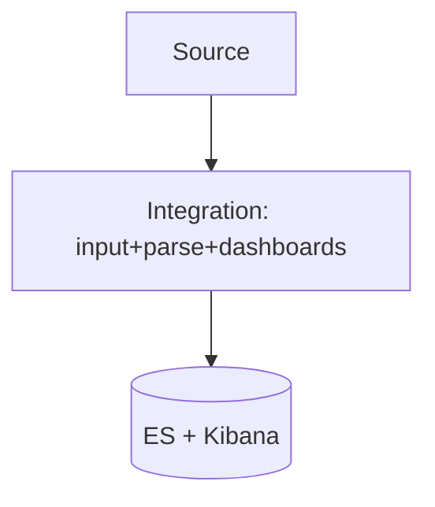

# Elastic Integrations

## What It Is
**Integrations** are turn-key packages in Fleet that bundle log/metric collection, ingest pipelines, ECS mappings, and ready-made dashboards for common sources (nginx, Kubernetes, AWS, system, etc.).

## Why It Exists
Reintegrating the same source repeatedly is wasteful. Integrations standardize ingestion + visualization per technology.

## Popular Logging Integrations
| Integration | Covers |
|-------------|--------|
| **System** | OS logs, auth, syslog |
| **Nginx / Apache** | Access & error logs |
| **Kubernetes** | Pod/container logs + metrics |
| **AWS / GCP / Azure** | Cloud logs |
| **Custom logs** | Your app via custom pipeline |

## Architecture

## When to Use It
- Default to an integration before custom config
- Use "Custom logs" integration for app logs

## Best Practices
- Prefer integrations (less config, ECS-correct)
- Pin integration versions
- Add custom parsing only when needed

## Related Concepts
- [Elastic Agent & Fleet](elastic-agent-fleet.md)
- [Ingest Pipelines](ingest-pipelines.md)
- [Kubernetes (OTel)](../13-kubernetes-deployment/README.md)
