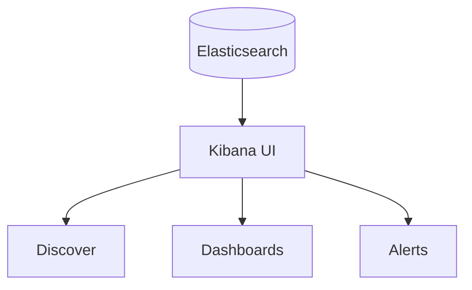

# Kibana UI

## What It Is
**Kibana** is the web UI for the Elastic Stack — search logs (Discover), build dashboards, maps, and manage alerts/integrations.

## Why It Exists
Elasticsearch is an API; Kibana makes logs **explorable and visual** for humans — the "view" layer of logging.

## Main Apps
| App | Use |
|-----|-----|
| **Discover** | Search & inspect raw logs |
| **Dashboards** | Saved visualizations |
| **Visualize Library** | Charts/maps |
| **Maps** | Geo data |
| **Alerts** | Rule-based notifications |
| **Stack Management** | ILM, ingest, roles |

## Architecture

## When to Use It
- Daily log investigation
- Building team dashboards
- Defining alert rules

## Best Practices
- Save frequent searches as saved objects
- Use KQL for fast filtering
- Share dashboards via spaces/roles

## Related Concepts
- [Discover](discover.md)
- [Dashboards](dashboards-visualizations.md)
- [Alerts](alerts.md)
