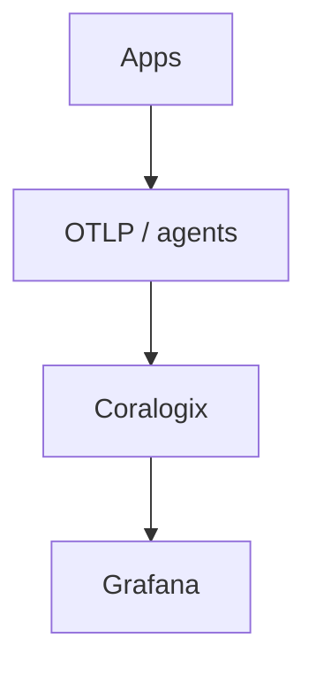

# 20 · Coralogix

> **Coralogix** is a SaaS observability platform with a strong **logging** focus and a **TCO-optimized** architecture: frequent logs become metrics/alerts, raw logs are archived cost-effectively. This section covers the platform, TCO optimizer, parsing rules, Loggregation, anomalies, alerts, Grafana, and OTLP ingestion.

## Topics in this section

| Document | Summary |
|----------|---------|
| [platform-overview.md](platform-overview.md) | Architecture & data flow |
| [tco-optimizer.md](tco-optimizer.md) | Cost-efficient logging model |
| [parsing-rules.md](parsing-rules.md) | Extracting fields in Coralogix |
| [loggregation.md](loggregation.md) | Aggregation / pattern clustering |
| [anomalies.md](anomalies.md) | ML anomaly detection |
| [alerts.md](alerts.md) | Alerting & notifications |
| [grafana-integration.md](grafana-integration.md) | Grafana + Coralogix |
| [otlp-coralogix.md](otlp-coralogix.md) | Ingest OpenTelemetry (OTLP) |
| [query-dataflow.md](query-dataflow.md) | Coralogix querying |
| [integrations-coralogix.md](integrations-coralogix.md) | Sources & integrations |
| [log-archiving.md](log-archiving.md) | Cost-effective archival (S3) |
| [use-cases.md](use-cases.md) | Common logging scenarios |

See the [main README](../README.md) for the full map.
