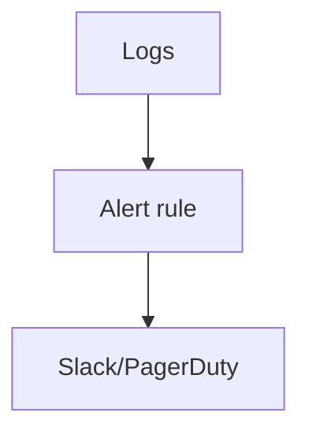

# Alerts (Coralogix)

## What It Is
**Coralogix alerts** trigger on log queries, pattern rates, anomalies, or metrics — notifying via Slack, PagerDuty, email, webhook, etc.

## Why It Exists
Logs must page when something breaks. Coralogix alerts work on indexed data and aggregated patterns.

## Alert Types
| Type | Trigger |
|------|---------|
| Log query | "level:error over 5m > 10" |
| Pattern rate | surge in a log pattern |
| Anomaly | ML-detected deviation |
| Metric | custom metric threshold |

## Architecture

## When to Use It
- Page on error-rate spikes
- Alert on new anomaly patterns
- Security patterns (auth failures)

## Best Practices
- Alert on pattern rates, not single lines
- De-duplicate; group by service
- Enrich alerts with `trace_id`/sample log
- Pair with Grafana dashboards

## Related Concepts
- [Loggregation](loggregation.md)
- [Anomalies](anomalies.md)
- [Grafana Integration](grafana-integration.md)
