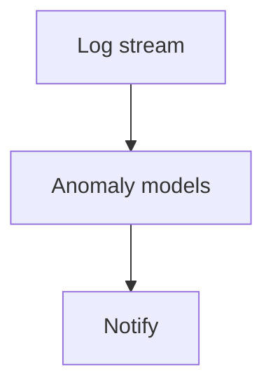

# Anomalies (Coralogix)

## What It Is
Coralogix provides **ML-based anomaly detection** on log volumes, patterns, and metrics — flagging statistically unusual behavior without manual thresholds.

## Why It Exists
Static thresholds miss novel failures and cause alert fatigue. ML baselines "normal" and alerts on deviation.

## What It Detects
| Signal | Example |
|--------|---------|
| Log volume spike/drop | Suddenly 10x errors |
| Pattern rate change | A rare error pattern surges |
| Metric deviation | Latency-from-logs drift |
| New pattern appearance | Never-seen-before error |

## Architecture

## When to Use It
- Reduce threshold tuning effort
- Catch unknown-unknowns
- Complement rule-based alerts

## Best Practices
- Let it baseline for a period before relying on it
- Combine with log-based SLOs
- Route anomalies to on-call with context

## Related Concepts
- [Loggregation](loggregation.md)
- [Alerts](alerts.md)
- [Log-based SLOs (practice)](../21-log-observability-practice/log-based-slos.md)
