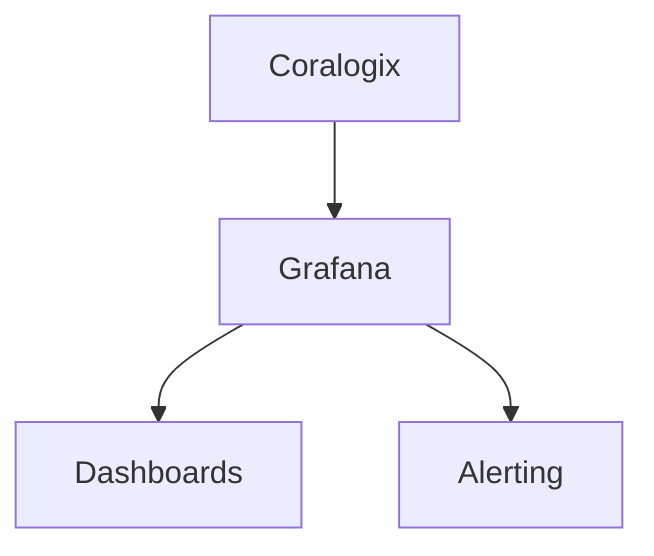

# Grafana + Coralogix

## What It Is
Coralogix integrates with **Grafana** so you can visualize logs/metrics from Coralogix alongside other data sources in unified dashboards (and use Grafana Alerting).

## Why It Exists
Teams standardized on Grafana want Coralogix data there too, without switching UIs.

## Integration Options
| Option | Notes |
|--------|-------|
| Coralogix Grafana data source / plugin | Query logs/metrics |
| Prometheus remote-write | Metrics into Grafana Mimir/Prometheus |
| Grafana Alerting | Alerts on Coralogix queries |

## Architecture

## When to Use It
- Unified observability dashboards
- Reuse existing Grafana on-call workflows

## Best Practices
- Build log-volume + error-rate panels
- Correlate with traces (OTel) in the same dashboard
- Use Grafana Alerting for routing

## Related Concepts
- [Alerts](alerts.md)
- [OTLP in Coralogix](otlp-coralogix.md)
- [Grafana (OTel)](../10-exporters-backends/grafana.md)
