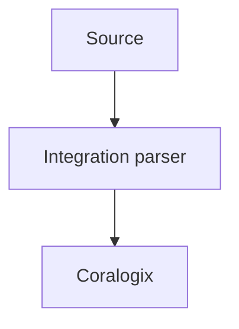

# Integrations (Coralogix)

## What It Is
Coralogix ships **integrations** (named "Applications"/parsers) for common log sources — Kubernetes, AWS, Nginx, Docker, databases, and more — with prebuilt parsing and dashboards.

## Why It Exists
Turn-key parsing/dashboards save reinventing ingestion per technology.

## Common Integrations
| Integration | Covers |
|-------------|--------|
| **Kubernetes** | Pod/container logs, events |
| **AWS** (CloudWatch, S3, Lambda) | Cloud logs |
| **Nginx / Apache** | Access/error logs |
| **Docker** | Container logs |
| **MySQL / Postgres** | DB logs |
| **Custom / JSON** | Your app |

## Architecture

## When to Use It
- Default to an integration before custom parsing
- Map your app to "Custom Logs" + JSON

## Best Practices
- Use application/subsystem naming consistently
- Prefer JSON app logs (skip parsing)
- Pair with OTLP ingestion for unified data

## Related Concepts
- [Parsing Rules](parsing-rules.md)
- [OTLP in Coralogix](otlp-coralogix.md)
- [Elastic Integrations (compare)](../19-kibana-elastic/integrations.md)
