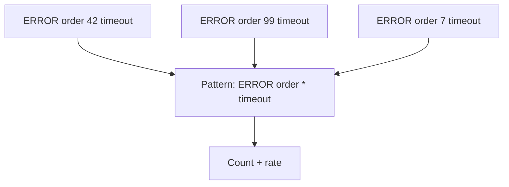

# Loggregation

## What It Is
**Loggregation** (log aggregation/clustering) groups similar log lines into **patterns**, collapsing thousands of unique messages into a manageable set of templates.

## Why It Exists
Production logs are mostly repetitive with rare anomalies. Clustering reveals "the pattern that's spiking" instead of drowning in unique lines.

## How It Works

- Variable parts (`42`, `99`) become wildcards
- Each pattern has a rate/trend
- Sudden rate change on a pattern = signal

## When to Use It
- Triage high-volume, noisy logs
- Spot new error patterns quickly
- Reduce alert noise (alert on pattern rate)

## Best Practices
- Alert on pattern *rate change*, not individual lines
- Drill into a pattern to see samples
- Combine with anomalies detection

## Related Concepts
- [Anomalies](anomalies.md)
- [Parsing Rules](parsing-rules.md)
- [Alerts](alerts.md)
