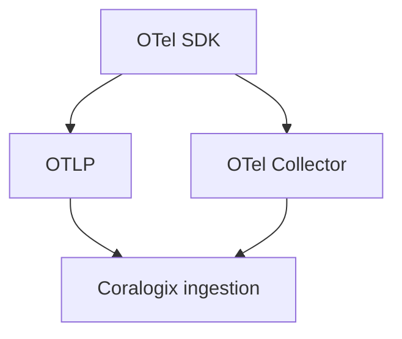

# Ingesting OpenTelemetry in Coralogix

## What It Is
Coralogix ingests **OpenTelemetry** natively via **OTLP** — logs, metrics, and traces from OTel SDKs/Collectors land in Coralogix without a vendor agent.

## Why It Exists
Teams using OTel SDKs can send directly to Coralogix, avoiding lock-in and reusing their existing instrumentation.

## Two Paths


## Configuration
- **Endpoint**: Coralogix OTLP endpoint (region-specific)
- **Auth**: Coralogix `PRIVATE_KEY` / application/subsystem names via headers or resource attributes
- **Protocols**: OTLP/gRPC (4317) or OTLP/HTTP (4318)

### OTel Collector exporter example
```yaml
exporters:
  otlphttp/coralogix:
    endpoint: https://ingress.<region>.coralogix.com:443
    headers:
      Authorization: "Bearer <PRIVATE_KEY>"
      CX-Application: "checkout"
      CX-Subsystem: "api"
```

## Best Practices
- Set `service.name` → maps to Coralogix Application
- Use the Collector for buffering/retry
- Correlate `trace_id` across logs/traces

## Related Concepts
- [Platform Overview](platform-overview.md)
- [OTLP (core)](../01-core-concepts/otlp.md)
- [OTel Exporters (core)](../10-exporters-backends/README.md)
