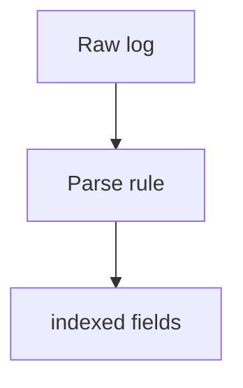

# Parsing Rules (Coralogix)

## What It Is
**Coralogix parsing rules** extract structured **fields** from raw log lines (JSON, grok, regex) so they can be filtered, aggregated, and alerted on.

## Why It Exists
Like any logging platform, fields unlock search and analytics. Coralogix lets you define parsing in the UI or via rules.

## Rule Types
| Type | Use |
|------|-----|
| **JSON** | Parse JSON logs directly |
| **Grok / Regex** | Extract from text |
| **Custom** | Multi-step extraction |
| **Enrichment** | AddLookup / reference data |

## Example (JSON parse)
```json
{"level":"error","order_id":42,"error":"timeout"}
→ fields: level, order_id, error
```

## Architecture


## When to Use It
- Always parse app logs into fields
- Use JSON emission to skip parsing

## Best Practices
- Prefer structured (JSON) emission
- Parse only fields you query
- Test rules before applying broadly
- Combine with Loggregation for patterns

## Related Concepts
- [Parsing (essentials)](../18-logging-essentials/parsing.md)
- [Loggregation](loggregation.md)
- [Ingest Pipelines (Kibana)](../19-kibana-elastic/ingest-pipelines.md)
