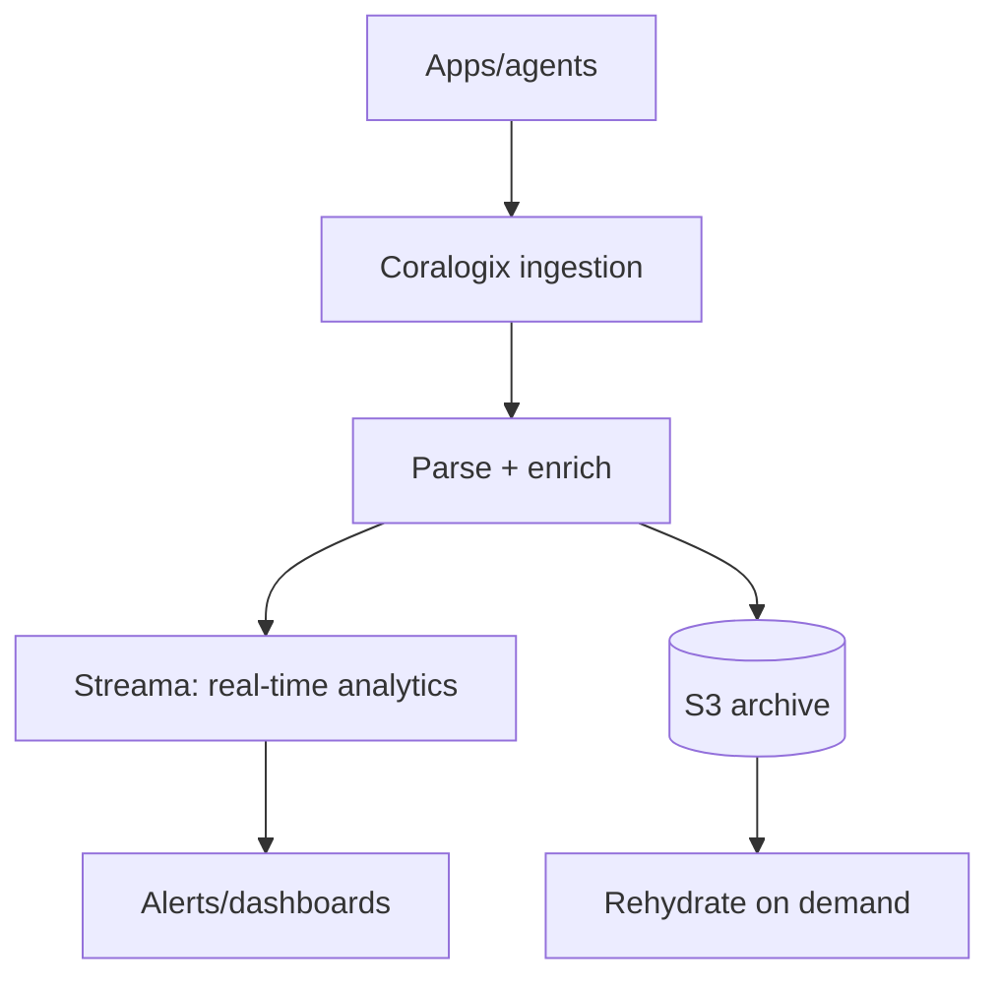

# Coralogix Platform Overview

## What It Is
**Coralogix** is a SaaS observability platform centered on **logs**, also covering metrics, traces, and security. Its differentiator is a **streaming analytics pipeline** that turns logs into actionable data without indexing everything.

## Why It Exists
Traditional logging indexes 100% of logs (expensive). Coralogix's model **indexes only what you alert/visualize on**, archiving the rest cheaply — dramatically lowering TCO.

## Data Flow

## Key Components
- **Ingest**: OTLP, syslog, Filebeat, Fluentd, API
- **Streama**: real-time log analytics / aggregation
- **TCO Optimizer**: indexes only what's needed
- **Archiving**: raw logs to object storage
- **Grafana / UI**: visualization

## When to Use It
- Cost-sensitive, high-volume logging
- Want logs + metrics + traces in one SaaS
- Need ML anomalies without manual thresholds

## Related Concepts
- [TCO Optimizer](tco-optimizer.md)
- [OTLP in Coralogix](otlp-coralogix.md)
- [Kibana (compare)](../19-kibana-elastic/README.md)
