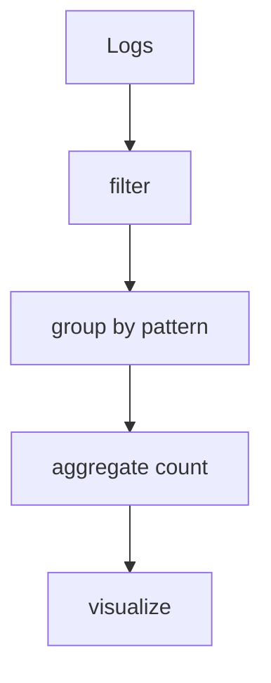

# Querying & Dataflow (Coralogix)

## What It Is
How you **search and analyze** logs in Coralogix — the query language, saved views, and the real-time **DataPrime** flow for transformation.

## Why It Exists
Investigating logs means filtering, grouping, and transforming; Coralogix provides both a Lucene-style query and a pipeline (DataPrime) for deeper analysis.

## Query Styles
| Style | Use |
|-------|-----|
| **Lucene-style** | Quick field filters (`level:error`) |
| **DataPrime** | Step-by-step transform/aggregate |
| **KQL-like** | Familiar to Kibana users |

## Example (Lucene)
```
application:checkout AND subsystem:api AND level:error
```

## DataPrime Flow


## When to Use It
- Triage in the UI
- Build saved views for teams
- Transform logs into metrics/tables

## Best Practices
- Save frequent queries as views
- Use fields created by parsing rules
- Combine with Loggregation for patterns

## Related Concepts
- [Parsing Rules](parsing-rules.md)
- [Loggregation](loggregation.md)
- [Query Languages (practice)](../21-log-observability-practice/query-languages.md)
