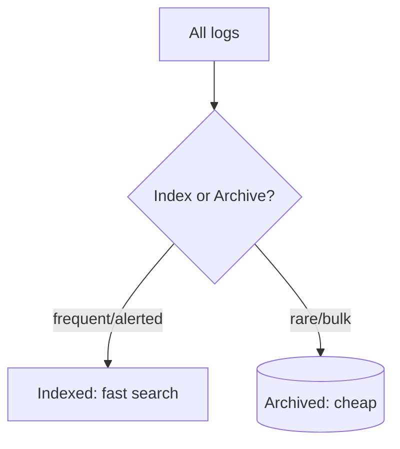

# TCO Optimizer

## What It Is
Coralogix's **TCO (Total Cost of Ownership) Optimizer** automatically controls which logs are **indexed** (searchable, costlier) vs **archived** (cheap, queryable on demand) to minimize cost while keeping value.

## Why It Exists
Indexing every log is the #1 logging cost driver. TCO optimization ensures you pay to index only logs you actually query/alert on.

## How It Works

- Frequent/error logs → indexed
- Verbose/bulk logs → archived to S3
- Rehydrate archived logs when needed

## When to Use It
- High-volume production logging
- Controlling monthly logging spend

## Best Practices
- Tag critical logs for indexing
- Use sampling for verbose debug
- Monitor ingested GB and TCO dashboard
- Rehydrate only during investigations

## Related Concepts
- [Log Archiving](log-archiving.md)
- [Logging Cost (essentials)](../18-logging-essentials/log-cost.md)
- [Retention (essentials)](../18-logging-essentials/retention.md)
