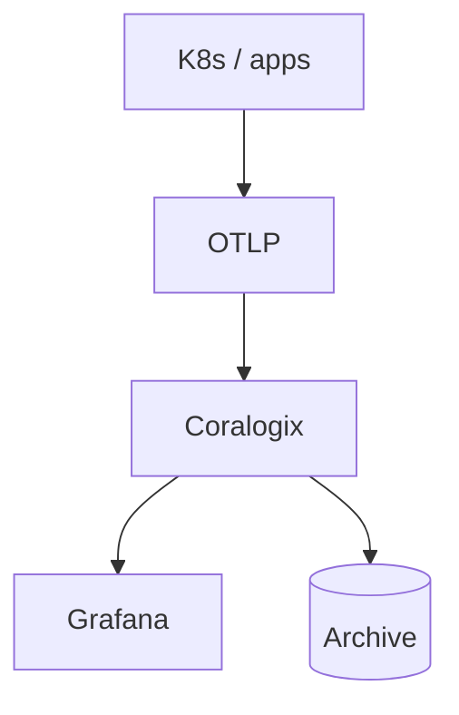

# Coralogix Use Cases

## What It Is
Common **logging scenarios** where Coralogix shines, compared to traditional index-everything platforms.

## Why It Exists
Helps teams decide fit and pattern their deployment.

## Scenarios
| Use Case | Why Coralogix |
|----------|--------------|
| **High-volume app logs** | TCO optimizer keeps cost low |
| **Compliance retention** | Cheap S3 archival + rehydrate |
| **Noise reduction** | Loggregation + anomalies |
| **Unified logs+metrics+traces** | One SaaS, OTLP-native |
| **Grafana shops** | Grafana integration |
| **Alert fatigue** | Pattern-rate + ML alerts |

## Architecture (typical)

## Best Practices
- Start with OTLP ingestion
- Use integrations for standard sources
- Combine TCO + archiving for cost

## Related Concepts
- [Platform Overview](platform-overview.md)
- [OTLP in Coralogix](otlp-coralogix.md)
- [Kibana (compare)](../19-kibana-elastic/README.md)
