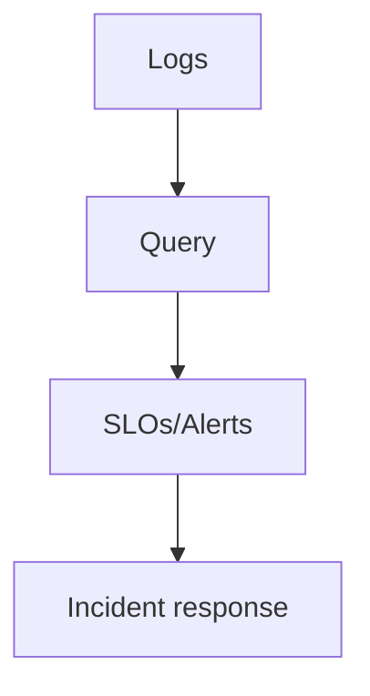

# 21 · Log Observability Practice

> Turning logs into **actionable reliability and security** on Kibana/Coralogix: query languages, log-based SLOs, troubleshooting, incident response, and log security.

## Topics in this section

| Document | Summary |
|----------|---------|
| [query-languages.md](query-languages.md) | KQL, Lucene, DataPrime |
| [log-based-slos.md](log-based-slos.md) | SLOs derived from logs |
| [troubleshooting-with-logs.md](troubleshooting-with-logs.md) | Debugging via logs |
| [incident-response-logs.md](incident-response-logs.md) | Logs during incidents |
| [log-security.md](log-security.md) | Security & compliance logging |
| [cost-governance.md](cost-governance.md) | Logging governance & budgets |

See the [main README](../README.md) for the full map.
