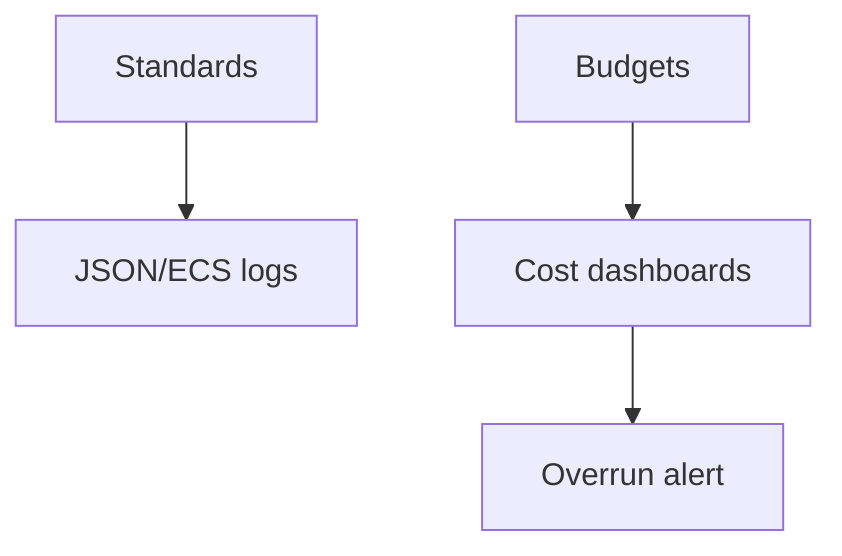

# Logging Cost Governance

## What It Is
**Governance** for logging: budgets, ownership, standards, and reviews to keep logging valuable and affordable across teams.

## Why It Exists
Without governance, logging sprawl (everyone logs everything, indexed) becomes the biggest observability cost and a reliability risk.

## Levers
| Lever | Action |
|-------|--------|
| **Budget per team** | GB/day caps; alert on overrun |
| **Standards** | ECS / OTel semconv, JSON emission |
| **TCO / ILM** | Index only what's needed; tier/archive |
| **Reviews** | Quarterly: drop unused dashboards/retention |
| **Ownership** | Each log stream has an owner |

## Architecture

## Best Practices
- Set per-team ingest budgets; alert at 80%
- Mandate structured (JSON) emission + ECS
- Use TCO (Coralogix) or ILM (Elastic) for tiering
- Review dashboards/retention quarterly

## Related Concepts
- [Logging Cost (essentials)](../18-logging-essentials/log-cost.md)
- [TCO Optimizer (Coralogix)](../20-coralogix/tco-optimizer.md)
- [ILM (Kibana)](../19-kibana-elastic/ilm.md)
