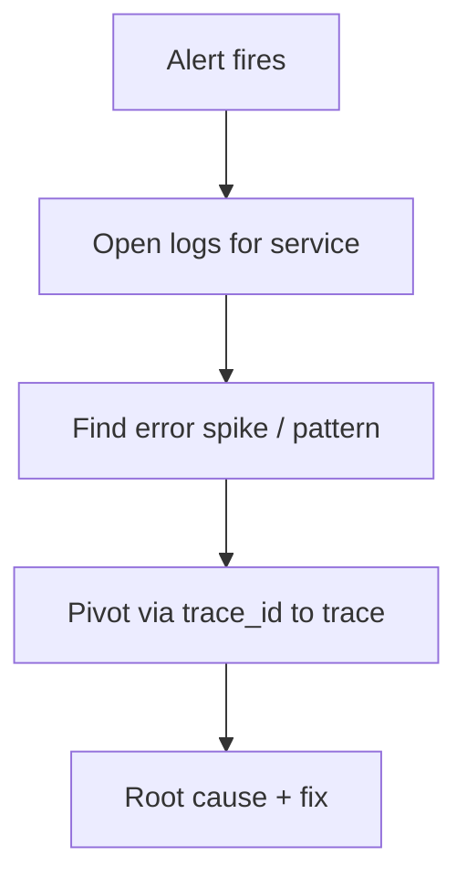

# Incident Response with Logs

## What It Is
Using logs **during incidents** to find root cause fast, on Kibana or Coralogix.

## Why It Exists
Incidents are time-critical; correlated, searchable logs turn "where's the problem?" into minutes.

## Flow

## Kibana
- Discover filtered to the service + window
- Dashboards for error rate
- `trace.id` jump to APM/trace

## Coralogix
- Loggregation shows surging pattern
- Anomaly alert context
- Rehydrate archived logs if needed

## Best Practices
- Pre-build per-service log dashboards
- Ensure `trace_id` correlation before incidents
- Use pattern-rate alerts (not single lines)
- Post-incident: what log was missing?

## Related Concepts
- [Troubleshooting with Logs](troubleshooting-with-logs.md)
- [Log-Based SLOs](log-based-slos.md)
- [Incident Response (OTel)](../14-observability-practice/incident-response.md)
