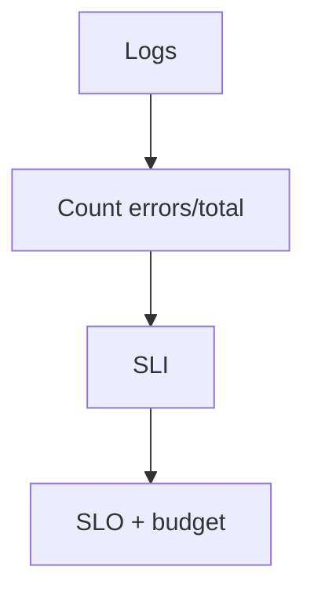

# Log-Based SLOs

## What It Is
**Log-based SLOs** derive Service Level Objectives from log data — e.g., "99.9% of requests succeed (no ERROR log)" or "p99 latency from log timestamps < 300ms."

## Why It Exists
Not every service exports metrics; logs are universal. You can still define reliability from logs.

## Examples
| SLO | Query basis |
|-----|-------------|
| Success rate | `level:error` / total over window |
| Latency | parse duration field → p99 |
| Availability | absence of fatal logs |

## Architecture

## When to Use It
- Services without metrics instrumentation
- Complement RED/USE SLOs

## Best Practices
- Parse latency fields for p99 SLOs
- Alert on error-budget burn rate
- Combine with trace-based SLOs where available

## Related Concepts
- [SLOs (OTel)](../14-observability-practice/slos.md)
- [Alerts (Kibana)](../19-kibana-elastic/alerts.md)
- [Alerts (Coralogix)](../20-coralogix/alerts.md)
