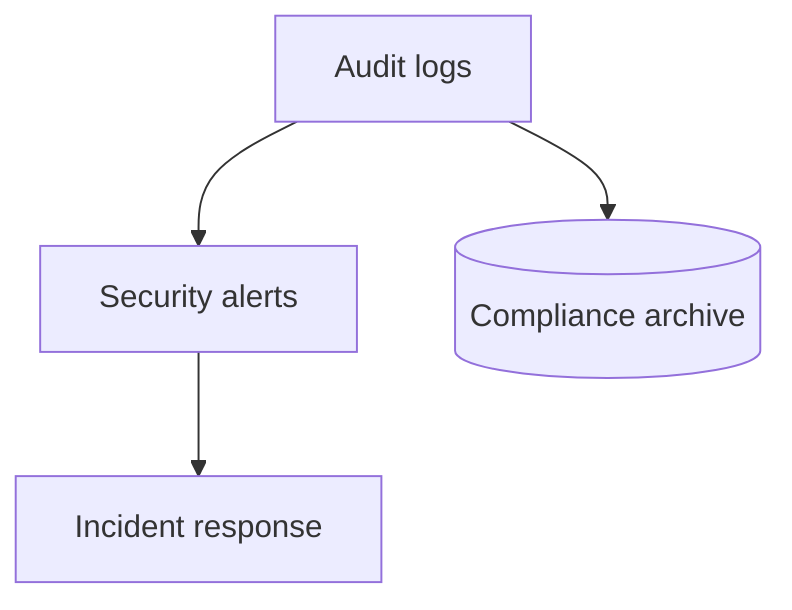

# Log Security & Compliance

## What It Is
Using logs for **security monitoring and compliance** — audit trails, auth failures, sensitive-data handling, and retention for regulatory needs.

## Why It Exists
Logs are both a security sensor (detect intrusions) and a compliance artifact (prove controls). Mishandling them creates risk.

## Security Use Cases
| Use Case | What to log/alert |
|----------|-------------------|
| Auth failures | repeated `level:warn` login failures |
| Access anomalies | unusual IP/geo (geoip) |
| Privilege use | admin actions audited |
| Data exfil | unusual egress patterns |

## Compliance
- **Retention**: keep audit logs per regulation (GDPR, SOC2, HIPAA)
- **Integrity**: tamper-evident storage
- **PII**: redact secrets; mask user data

## Architecture

## Best Practices
- Redact secrets at the agent/processor (don't log tokens)
- Separate security logs from app logs (retention/access)
- Alert on auth patterns via Kibana/Coralogix alerts
- Encrypt archives; control access via roles

## Related Concepts
- [Log Archiving (Coralogix)](../20-coralogix/log-archiving.md)
- [Retention (essentials)](../18-logging-essentials/retention.md)
- [Enrichment (essentials)](../18-logging-essentials/enrichment.md)
