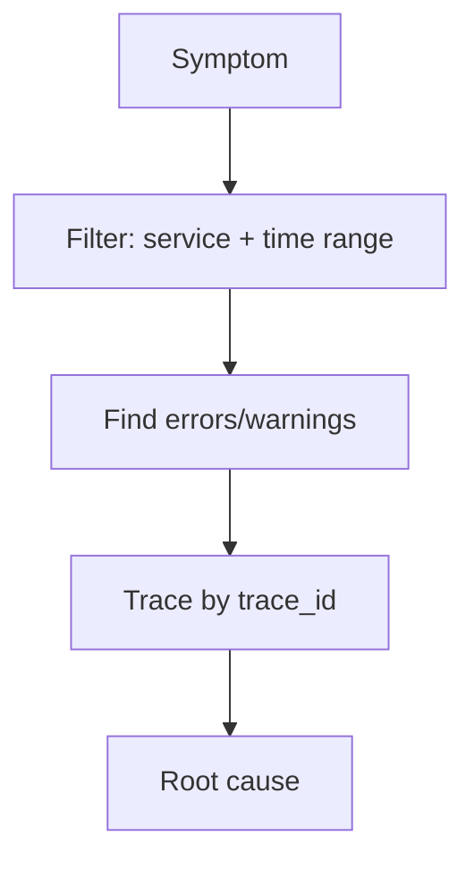

# Troubleshooting with Logs

## What It Is
A practical method for **debugging systems using logs** in Kibana/Coralogix.

## Why It Exists
Logs are the first stop in most investigations; a repeatable method beats random grepping.

## Method


1. Scope: `service.name` + time window
2. Filter to `level:error` / `level:warn`
3. Look at patterns (Loggregation) for spikes
4. Pivot via `trace_id` to the full request
5. Inspect sample log for context

## Kibana Example
```
service.name: checkout and log.level: error and @timestamp > now-15m
```

## Coralogix Example
```
application:checkout AND subsystem:api AND level:error
```

## Best Practices
- Always set a time range
- Use structured fields, not message grep
- Correlate logs ↔ traces ↔ metrics
- Save the query for next time

## Related Concepts
- [Query Languages](query-languages.md)
- [Incident Response](incident-response-logs.md)
- [Trace ID Correlation](../03-traces/trace-id-correlation.md)
