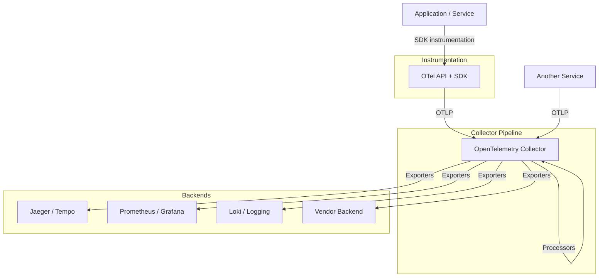

# OpenTelemetry Logging Encyclopedia — "OTEL Related" (Kibana / Coralogix focused)

> **Everything you need to know about OpenTelemetry and modern logging — from core concepts (traces, metrics, logs, profiling) to the Collector pipeline, instrumentation, semantic conventions, Kubernetes deployment, troubleshooting, interview prep, and real-world company adoption — with a deep focus on centralized logging on [Kibana / Elastic Stack](#19--kibana--the-elastic-stack) and [Coralogix](#20--coralogix).** Inspired by the structure of [K8S-Everything](https://github.com/WhoisMonesh/K8S-Everything) and [All-AWS-Services-Explained](https://github.com/WhoisMonesh/All-AWS-Services-Explained).

---

## Table of Contents

| # | Category | Topics | Files |
|---|----------|--------|-------|
| 1 | [Core Concepts](01-core-concepts/README.md) | What is OTel, Observability, Signals, OTLP, Telemetry Data Model, API vs SDK, Resource, Attributes, Instrumentation, Exporter, Semantic Conventions | 14 |
| 2 | [Architecture](02-architecture/README.md) | Collector Pipeline, Agent vs Gateway, Receivers, Processors, Exporters, Connectors, Sampling, Deployment Modes | 9 |
| 3 | [Traces](03-traces/README.md) | Spans, SpanContext, Parent/Child, Attributes, Events, Links, Span Status, Baggage, W3C Trace Context | 10 |
| 4 | [Metrics](04-metrics/README.md) | Counter, Gauge, Histogram, Async Instruments, Views, Aggregation, Exemplars, Metric Streams | 10 |
| 5 | [Logs](05-logs/README.md) | LogRecord, Severity, Log Attributes, Log SDK, Bridging, Log Appenders, Log Correlation | 9 |
| 6 | [Collector](06-collector/README.md) | otelcol, Config, Extensions, Processors Deep Dive, Exporters Deep Dive, Health, Scaling | 8 |
| 7 | [Context Propagation](07-context-propagation/README.md) | W3C Trace Context, Baggage, Propagators, B3, Composite Propagators, Cross-Process | 6 |
| 8 | [Instrumentation](08-instrumentation/README.md) | Manual, Auto / Zero-Code, Libraries, Web, Mobile, eBPF, Doppler | 8 |
| 9 | [Language SDKs](09-language-sdks/README.md) | Go, Python, Java, JS/TS, .NET, Rust, C++, Ruby, PHP, Swift | 10 |
| 10 | [Exporters & Backends](10-exporters-backends/README.md) | Jaeger, Tempo, Prometheus, Loki, Honeycomb, Grafana, Lightstep, Datadog, New Relic, Elastic, Coralogix | 13 |
| 11 | [Semantic Conventions](11-semantic-conventions/README.md) | Attributes, Resource, HTTP, DB, Messaging, RPC, FaaS, System, K8s, Exceptions | 10 |
| 12 | [Profiling](12-profiling/README.md) | Continuous Profiling, pprof, eBPF Profiling, OTLP Profiles, Flamegraphs | 5 |
| 13 | [Kubernetes Deployment](13-kubernetes-deployment/README.md) | Operator, Helm, DaemonSet Agent, Gateway, OTel CRDs, Auto-Instrumentation | 8 |
| 14 | [Observability Practice](14-observability-practice/README.md) | Golden Signals, RED/USE, SLOs, Alerting, Cost, OpenTelemetry Demo | 7 |
| 15 | [Troubleshooting](15-troubleshooting/README.md) | Missing Spans, Dropped Data, OOM, Sampling Loss, Collector Errors, Runbooks | 7 |
| 16 | [Interview Prep](16-interview-prep/README.md) | Concepts, Common Questions, Cheatsheets | 7 |
| 17 | [Company Cases](17-company-cases/README.md) | Adoption stories, migrations, lessons learned | 7 |
| 18 | [Logging Essentials](18-logging-essentials/README.md) | Structured logging, Levels, Formats, Centralized, Shipping, Agents, Parsing, Enrichment, Indexing, Retention, Cost | 12 |
| 19 | [Kibana / Elastic Stack](19-kibana-elastic/README.md) | Elasticsearch, Kibana UI, ECS, Discover, Dashboards, Alerts, ILM, Data Streams, Ingest, Beats, Fleet, OTLP, Integrations | 14 |
| 20 | [Coralogix](20-coralogix/README.md) | Platform, TCO Optimizer, Parsing, Loggregation, Anomalies, Alerts, Grafana, OTLP, Query, Integrations, Archiving, Use Cases | 13 |
| 21 | [Log Observability Practice](21-log-observability-practice/README.md) | Query Languages, Log SLOs, Troubleshooting, Incident Response, Security, Cost Governance | 7 |
| — | [Cheat Sheets](cheat-sheets/) · [Docs](docs/) · [Examples](examples/) | Quick references, guides, YAML/tutorials | 9+ |

**Total: ~200 OpenTelemetry + logging concepts, components, tools, and patterns across 21 topic categories + reference docs — 220 documents in total.**

> 💡 *Logging-centric: Sections 18–21 add a full logging track — fundamentals (structured logs, agents, parsing, ILM, cost) plus deep coverage of **Kibana/Elastic Stack** and **Coralogix** (TCO-optimized, Loggregation, anomalies, archiving), with OTLP ingestion for both. The OTel backbone (signals, Collector, instrumentation, SDKs, semantic conventions, Kubernetes) remains the data source feeding these platforms.*

---

## OpenTelemetry Overview

### What Is OpenTelemetry?

**OpenTelemetry (OTel)** is a **vendor-neutral, open-source observability framework** for generating, collecting, and exporting **telemetry data** — **traces, metrics, logs, and profiles** — from your applications and infrastructure. It is a [CNCF](https://www.cncf.io/) graduated project, formed by merging OpenTracing and OpenCensus, and is the de-facto standard for instrumentation.

### Why It Exists

| Problem | Before OpenTelemetry | OpenTelemetry Solution |
|---------|----------------------|-----------------------|
| Vendor lock-in | Each backend (Jaeger, Prometheus, Datadog) had its own SDK | One SDK, many exporters |
| Re-instrumentation | Switching backends meant rewriting code | Change only the exporter |
| Fragmented signals | Separate libraries for traces/metrics/logs | Single API + SDK for all signals |
| Manual propagation | Custom context-passing code | Standardized W3C `traceparent` |
| Inconsistent data | No shared attribute names | Semantic Conventions |

---

## The OpenTelemetry Pipeline

---

## Complete OTel Component Index

> See [COMPLETE-INDEX.md](COMPLETE-INDEX.md) for the exhaustive, categorized list of every OpenTelemetry concept, component, tool, and pattern covered.

## Reference Documentation

| Reference | Description |
|-----------|-------------|
| [OTLP Specification](docs/otlp-specification.md) | OTLP wire protocol, gRPC/HTTP, Protobuf |
| [Version & Stability](docs/version-stability.md) | Stability levels, versioning, release cadence |
| [Companies Using OTel](17-company-cases/README.md) | Major companies and their OTel adoption |
| [Semantic Conventions Index](11-semantic-conventions/README.md) | Standard attribute namespaces |
| [Collector Config Cheatsheet](cheat-sheets/collector-config.md) | Collector YAML quick reference |
| [CLI / OTel CLI Cheatsheet](cheat-sheets/otel-cli.md) | `otelcli`, `otelcol` commands |

---

## Learning Path

1. **Start with fundamentals**: Core Concepts → Architecture
2. **Learn the signals**: Traces → Metrics → Logs → Profiling
3. **Operate it**: Collector → Context Propagation → Instrumentation
4. **Integrate**: Language SDKs → Exporters & Backends → Semantic Conventions
5. **Deploy**: Kubernetes Deployment → Observability Practice
6. **Master debugging**: Troubleshooting → Real Cases
7. **Ace interviews**: Interview Prep

---

## Document Structure

Each concept document follows this structure:

- **What It Is** — Simple, one-line definition
- **Why It Exists** — The problem it solves
- **Architecture** — Visual diagram with Mermaid
- **Key Features** — Bullet points of important capabilities
- **When to Use It** — Ideal use cases
- **Code Example** — SDK snippets, Collector YAML, CLI commands
- **Best Practices** — Operational guidance
- **Common Issues & Solutions** — Real-world problems and fixes
- **Interview Questions** — Common Q&A (where relevant)
- **Related Concepts** — Cross-references

---

## Getting Started

1. **Browse by category** — Use the table of contents above
2. **Search for concepts** — Use GitHub search or [COMPLETE-INDEX.md](COMPLETE-INDEX.md)
3. **Deep dive** — Check the Reference Documentation section
4. **Practice** — See [examples/](examples) for YAML/tutorials and [cheat-sheets/](cheat-sheets) for quick references
5. **Interview prep** — Visit [16-interview-prep](16-interview-prep/README.md)

---

## License

Educational reference for OpenTelemetry practitioners, SREs, and developers building observable systems.

Use `git clone https://github.com/<you>/OTEL-Related` to clone this repository.

