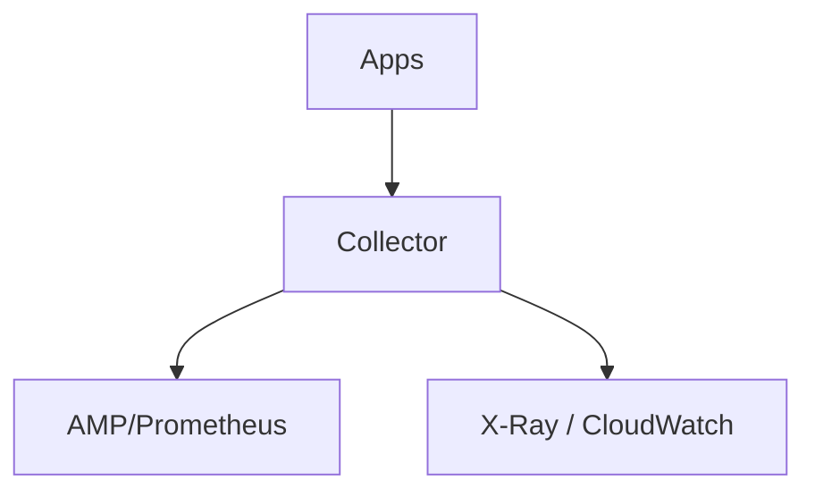

# Cloud Integrations

Running OpenTelemetry on major cloud providers.

## Managed Options
| Provider | Offering |
|----------|----------|
| **AWS** | Amazon Managed Service for Prometheus (AMP), Managed Grafana (AMG), ADOT (AWS Distro for OpenTelemetry) |
| **GCP** | Google Cloud Managed Service for Prometheus, Cloud Trace/Monitoring ingest OTLP, GKE OTel Operator |
| **Azure** | Azure Monitor (ingests OTLP), Container Insights, AKS OTel add-on |

## ADOT (AWS Distro for OpenTelemetry)
- AWS-supported Collector distribution
- Prebuilt exporters to X-Ray, CloudWatch, AMP
- Lambda layer for OTel

## Patterns

## Best Practices
- Use the cloud's managed Prometheus for metrics scale
- Export traces to the managed tracing service or Tempo/Jaeger
- Use cloud resource detectors for `cloud.*` attributes

## Related Concepts
- [Resource Conventions](../11-semantic-conventions/resource.md)
- [Kubernetes Deployment](../13-kubernetes-deployment/README.md)
- [Exporters & Backends](../10-exporters-backends/README.md)
